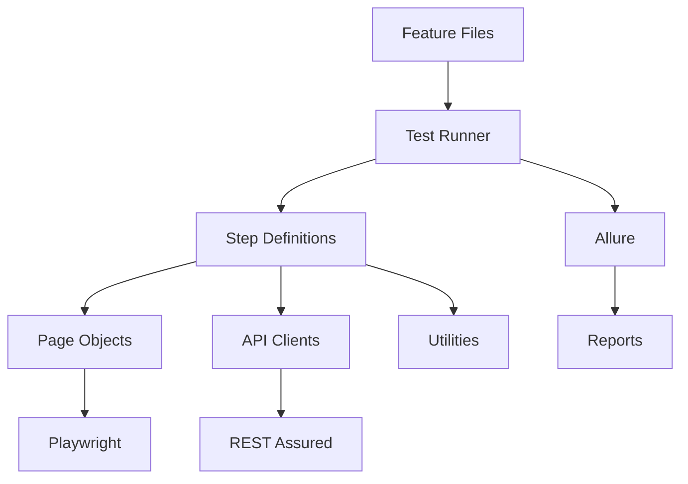

# Framework Development Guide

This guide provides detailed instructions for extending and maintaining the BDD Playwright Automation Framework.

## 🏗️ Architecture Overview

### Framework Components



### Design Patterns Used

1. **Page Object Model (POM)** - Web UI abstraction
2. **Client Pattern** - API service abstraction
3. **Builder Pattern** - Complex object creation
4. **Factory Pattern** - Browser/driver initialization
5. **Singleton Pattern** - Configuration management

## 📁 Package Structure Guidelines

### Main Source (`src/main/java`)

```
com.framework/
├── api/
│   ├── client/          # API client implementations
│   ├── model/           # Request/Response DTOs
│   └── utils/           # API-specific utilities
├── config/              # Configuration classes
├── core/                # Framework core components
│   ├── browser/         # Browser management
│   ├── driver/          # Driver utilities
│   └── reporting/       # Custom reporting
├── utils/               # Common utilities
└── web/
    ├── pages/           # Page Object classes
    ├── components/      # Reusable UI components
    └── utils/           # Web-specific utilities
```

### Test Source (`src/test/java`)

```
com.framework/
├── api/
│   └── stepdefs/        # API step definitions
├── web/
│   └── stepdefs/        # Web step definitions
├── hooks/               # Test hooks (Before/After)
├── runners/             # Test runners
└── utils/               # Test-specific utilities
```

## 🔧 Adding New Components

### 1. Creating New Page Objects

**Template for Page Object:**

```java
package com.framework.web.pages;

import com.microsoft.playwright.Page;
import com.microsoft.playwright.options.WaitForSelectorState;

public class NewPage {
    private final Page page;
    
    // Locators
    private static final String ELEMENT_SELECTOR = "#element-id";
    private static final String BUTTON_SELECTOR = "button[data-testid='submit']";
    
    public NewPage(Page page) {
        this.page = page;
    }
    
    // Page actions
    public void navigateTo(String url) {
        page.navigate(url);
        waitForPageLoad();
    }
    
    public void clickElement() {
        page.waitForSelector(ELEMENT_SELECTOR, new Page.WaitForSelectorOptions()
            .setState(WaitForSelectorState.VISIBLE));
        page.click(ELEMENT_SELECTOR);
    }
    
    public String getElementText() {
        return page.textContent(ELEMENT_SELECTOR);
    }
    
    // Verification methods
    public boolean isElementVisible() {
        return page.isVisible(ELEMENT_SELECTOR);
    }
    
    private void waitForPageLoad() {
        page.waitForLoadState();
    }
}
```

**Best Practices for Page Objects:**
- ✅ Use descriptive method names
- ✅ Implement explicit waits
- ✅ Keep locators as constants
- ✅ Separate actions from assertions
- ✅ Handle dynamic content appropriately

### 2. Creating New API Clients

**Template for API Client:**

```java
package com.framework.api.client;

import com.framework.api.model.NewRequest;
import com.framework.api.model.NewResponse;
import io.restassured.response.Response;
import static io.restassured.RestAssured.given;

public class NewApiClient {
    private static final String BASE_URL = System.getProperty("api.url", "https://api.example.com");
    private static final String ENDPOINT = "/api/v1/new";
    
    public Response getResource(String id) {
        return given()
            .baseUri(BASE_URL)
            .header("Content-Type", "application/json")
            .when()
            .get(ENDPOINT + "/" + id);
    }
    
    public Response createResource(NewRequest request) {
        return given()
            .baseUri(BASE_URL)
            .header("Content-Type", "application/json")
            .body(request)
            .when()
            .post(ENDPOINT);
    }
    
    public Response updateResource(String id, NewRequest request) {
        return given()
            .baseUri(BASE_URL)
            .header("Content-Type", "application/json")
            .body(request)
            .when()
            .put(ENDPOINT + "/" + id);
    }
    
    public Response deleteResource(String id) {
        return given()
            .baseUri(BASE_URL)
            .when()
            .delete(ENDPOINT + "/" + id);
    }
}
```

**Best Practices for API Clients:**
- ✅ Use consistent naming conventions
- ✅ Handle authentication/authorization
- ✅ Implement proper error handling
- ✅ Use environment-specific configurations
- ✅ Add request/response logging

### 3. Creating DTOs (Data Transfer Objects)

**Request DTO Template:**

```java
package com.framework.api.model;

import com.fasterxml.jackson.annotation.JsonProperty;

public class NewRequest {
    @JsonProperty("name")
    private String name;
    
    @JsonProperty("email")
    private String email;
    
    @JsonProperty("status")
    private String status;
    
    // Constructors
    public NewRequest() {}
    
    public NewRequest(String name, String email, String status) {
        this.name = name;
        this.email = email;
        this.status = status;
    }
    
    // Getters and setters
    public String getName() { return name; }
    public void setName(String name) { this.name = name; }
    
    public String getEmail() { return email; }
    public void setEmail(String email) { this.email = email; }
    
    public String getStatus() { return status; }
    public void setStatus(String status) { this.status = status; }
    
    // Builder pattern (optional)
    public static Builder builder() {
        return new Builder();
    }
    
    public static class Builder {
        private String name;
        private String email;
        private String status;
        
        public Builder name(String name) {
            this.name = name;
            return this;
        }
        
        public Builder email(String email) {
            this.email = email;
            return this;
        }
        
        public Builder status(String status) {
            this.status = status;
            return this;
        }
        
        public NewRequest build() {
            return new NewRequest(name, email, status);
        }
    }
}
```

### 4. Creating Step Definitions

**Template for Step Definitions:**

```java
package com.framework.web.stepdefs;

import com.framework.web.pages.NewPage;
import com.microsoft.playwright.Page;
import io.cucumber.java.en.*;
import io.qameta.allure.Step;
import org.junit.jupiter.api.Assertions;

public class NewSteps {
    private NewPage newPage;
    private Page page;
    
    @Given("I am on the new page")
    @Step("Navigate to new page")
    public void i_am_on_the_new_page() {
        // Initialize page if not already done
        newPage = new NewPage(page);
        newPage.navigateTo("/new");
    }
    
    @When("I perform action with {string}")
    @Step("Perform action with parameter: {0}")
    public void i_perform_action_with(String parameter) {
        newPage.performAction(parameter);
    }
    
    @Then("I should see {string}")
    @Step("Verify expected result: {0}")
    public void i_should_see(String expectedResult) {
        String actualResult = newPage.getResult();
        Assertions.assertEquals(expectedResult, actualResult);
    }
}
```

**Best Practices for Step Definitions:**
- ✅ Use descriptive step names
- ✅ Add Allure @Step annotations
- ✅ Keep steps atomic and reusable
- ✅ Handle test data properly
- ✅ Implement proper error handling

## 🔄 Test Hooks and Configuration

### Creating Global Hooks

```java
package com.framework.hooks;

import com.microsoft.playwright.*;
import io.cucumber.java.*;
import io.qameta.allure.Allure;

public class WebHooks {
    private static Playwright playwright;
    private static Browser browser;
    private static BrowserContext context;
    private static Page page;
    
    @BeforeAll
    public static void beforeAll() {
        playwright = Playwright.create();
        browser = playwright.chromium().launch(new BrowserType.LaunchOptions()
            .setHeadless(Boolean.parseBoolean(System.getProperty("headless", "true"))));
    }
    
    @Before("@web")
    public void beforeScenario() {
        context = browser.newContext();
        page = context.newPage();
        // Make page available to step definitions
        PageContext.setPage(page);
    }
    
    @After("@web")
    public void afterScenario(Scenario scenario) {
        if (scenario.isFailed() && page != null) {
            byte[] screenshot = page.screenshot();
            Allure.addAttachment("Screenshot", "image/png", 
                new ByteArrayInputStream(screenshot), "png");
        }
        
        if (context != null) {
            context.close();
        }
    }
    
    @AfterAll
    public static void afterAll() {
        if (browser != null) {
            browser.close();
        }
        if (playwright != null) {
            playwright.close();
        }
    }
}
```

### Configuration Management

```java
package com.framework.config;

import java.io.IOException;
import java.io.InputStream;
import java.util.Properties;

public class TestConfiguration {
    private static final Properties properties = new Properties();
    private static TestConfiguration instance;
    
    private TestConfiguration() {
        loadProperties();
    }
    
    public static TestConfiguration getInstance() {
        if (instance == null) {
            instance = new TestConfiguration();
        }
        return instance;
    }
    
    private void loadProperties() {
        try {
            String env = System.getProperty("env", "dev");
            InputStream stream = getClass().getClassLoader()
                .getResourceAsStream("config/" + env + ".properties");
            properties.load(stream);
        } catch (IOException e) {
            throw new RuntimeException("Failed to load configuration", e);
        }
    }
    
    public String getProperty(String key) {
        return System.getProperty(key, properties.getProperty(key));
    }
    
    public String getBaseUrl() {
        return getProperty("base.url");
    }
    
    public String getApiUrl() {
        return getProperty("api.url");
    }
    
    public boolean isHeadless() {
        return Boolean.parseBoolean(getProperty("headless"));
    }
}
```

## 📊 Custom Reporting

### Enhanced Allure Integration

```java
package com.framework.reporting;

import io.qameta.allure.Allure;
import io.qameta.allure.model.Status;

public class AllureReporter {
    
    public static void addStep(String stepName, String description) {
        Allure.step(stepName, () -> {
            Allure.addAttachment("Step Details", description);
        });
    }
    
    public static void addScreenshot(byte[] screenshot) {
        Allure.addAttachment("Screenshot", "image/png", 
            new ByteArrayInputStream(screenshot), "png");
    }
    
    public static void addApiRequest(String request) {
        Allure.addAttachment("API Request", "application/json", request, "json");
    }
    
    public static void addApiResponse(String response) {
        Allure.addAttachment("API Response", "application/json", response, "json");
    }
    
    public static void markStepAsFailed(String reason) {
        Allure.getLifecycle().updateStep(stepResult -> 
            stepResult.setStatus(Status.FAILED).setStatusDetails(reason));
    }
}
```

## 🧪 Testing Best Practices

### Test Data Management

```java
package com.framework.utils;

import com.fasterxml.jackson.databind.ObjectMapper;
import java.io.InputStream;

public class TestDataProvider {
    private static final ObjectMapper mapper = new ObjectMapper();
    
    public static <T> T loadTestData(String fileName, Class<T> clazz) {
        try {
            InputStream stream = TestDataProvider.class.getClassLoader()
                .getResourceAsStream("testdata/" + fileName);
            return mapper.readValue(stream, clazz);
        } catch (Exception e) {
            throw new RuntimeException("Failed to load test data: " + fileName, e);
        }
    }
    
    public static String generateRandomEmail() {
        return "test" + System.currentTimeMillis() + "@example.com";
    }
    
    public static String generateRandomString(int length) {
        return RandomStringUtils.randomAlphabetic(length);
    }
}
```

### Parallel Execution Support

```java
package com.framework.core;

public class ThreadLocalManager {
    private static final ThreadLocal<Page> pageThreadLocal = new ThreadLocal<>();
    private static final ThreadLocal<BrowserContext> contextThreadLocal = new ThreadLocal<>();
    
    public static void setPage(Page page) {
        pageThreadLocal.set(page);
    }
    
    public static Page getPage() {
        return pageThreadLocal.get();
    }
    
    public static void setContext(BrowserContext context) {
        contextThreadLocal.set(context);
    }
    
    public static BrowserContext getContext() {
        return contextThreadLocal.get();
    }
    
    public static void cleanup() {
        pageThreadLocal.remove();
        contextThreadLocal.remove();
    }
}
```

## 📋 Code Quality Guidelines

### Naming Conventions

- **Classes**: PascalCase (e.g., `LoginPage`, `UserApiClient`)
- **Methods**: camelCase (e.g., `clickLoginButton`, `getUserById`)
- **Variables**: camelCase (e.g., `userName`, `apiResponse`)
- **Constants**: UPPER_SNAKE_CASE (e.g., `BASE_URL`, `LOGIN_BUTTON`)
- **Packages**: lowercase (e.g., `com.framework.web.pages`)

### Documentation Standards

```java
/**
 * Page Object for the Login functionality
 * 
 * @author Framework Team
 * @version 1.0
 * @since 2024-01-01
 */
public class LoginPage {
    
    /**
     * Enters username in the username field
     * 
     * @param username The username to enter
     * @throws RuntimeException if the username field is not found
     */
    public void enterUsername(String username) {
        // Implementation
    }
}
```

### Error Handling

```java
public class FrameworkException extends RuntimeException {
    public FrameworkException(String message) {
        super(message);
    }
    
    public FrameworkException(String message, Throwable cause) {
        super(message, cause);
    }
}

// Usage in page objects
public void clickElement() {
    try {
        page.click(ELEMENT_SELECTOR);
    } catch (PlaywrightException e) {
        throw new FrameworkException("Failed to click element: " + ELEMENT_SELECTOR, e);
    }
}
```

## 🔍 Debugging and Troubleshooting

### Logging Configuration

```java
package com.framework.utils;

import org.slf4j.Logger;
import org.slf4j.LoggerFactory;

public class LogUtils {
    private static final Logger logger = LoggerFactory.getLogger(LogUtils.class);
    
    public static void info(String message) {
        logger.info(message);
    }
    
    public static void debug(String message) {
        logger.debug(message);
    }
    
    public static void error(String message, Throwable throwable) {
        logger.error(message, throwable);
    }
    
    public static void logApiRequest(String method, String url, String body) {
        logger.info("API Request: {} {} - Body: {}", method, url, body);
    }
    
    public static void logApiResponse(int statusCode, String body) {
        logger.info("API Response: {} - Body: {}", statusCode, body);
    }
}
```

### Performance Monitoring

```java
package com.framework.utils;

public class PerformanceUtils {
    
    public static long measureExecutionTime(Runnable action) {
        long startTime = System.currentTimeMillis();
        action.run();
        long endTime = System.currentTimeMillis();
        return endTime - startTime;
    }
    
    public static void logPerformanceMetric(String operation, long duration) {
        LogUtils.info("Performance: {} took {}ms", operation, duration);
        
        if (duration > 5000) { // 5 seconds threshold
            LogUtils.info("Slow operation detected: {} took {}ms", operation, duration);
        }
    }
}
```

## 🚀 Continuous Integration

### Maven Profiles for Different Environments

```xml
<profiles>
    <profile>
        <id>dev</id>
        <properties>
            <env>dev</env>
            <base.url>http://localhost:3000</base.url>
            <api.url>http://localhost:8080</api.url>
        </properties>
    </profile>
    
    <profile>
        <id>staging</id>
        <properties>
            <env>staging</env>
            <base.url>https://staging.example.com</base.url>
            <api.url>https://api.staging.example.com</api.url>
        </properties>
    </profile>
    
    <profile>
        <id>prod</id>
        <properties>
            <env>prod</env>
            <base.url>https://example.com</base.url>
            <api.url>https://api.example.com</api.url>
        </properties>
    </profile>
</profiles>
```

---
*This guide should be updated as the framework evolves. Always ensure new additions follow the established patterns and best practices.*
